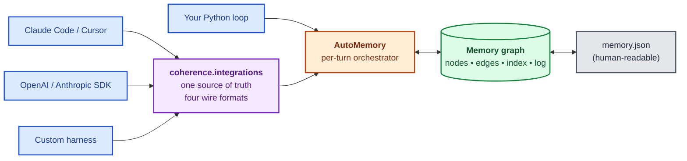
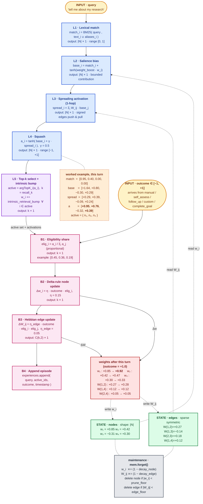
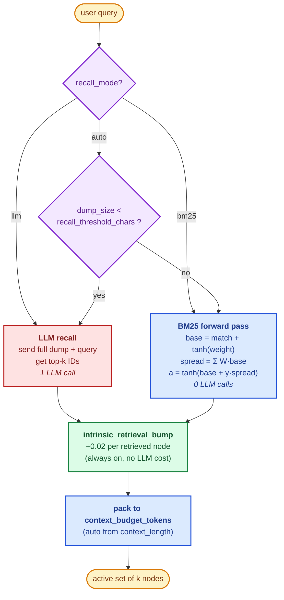
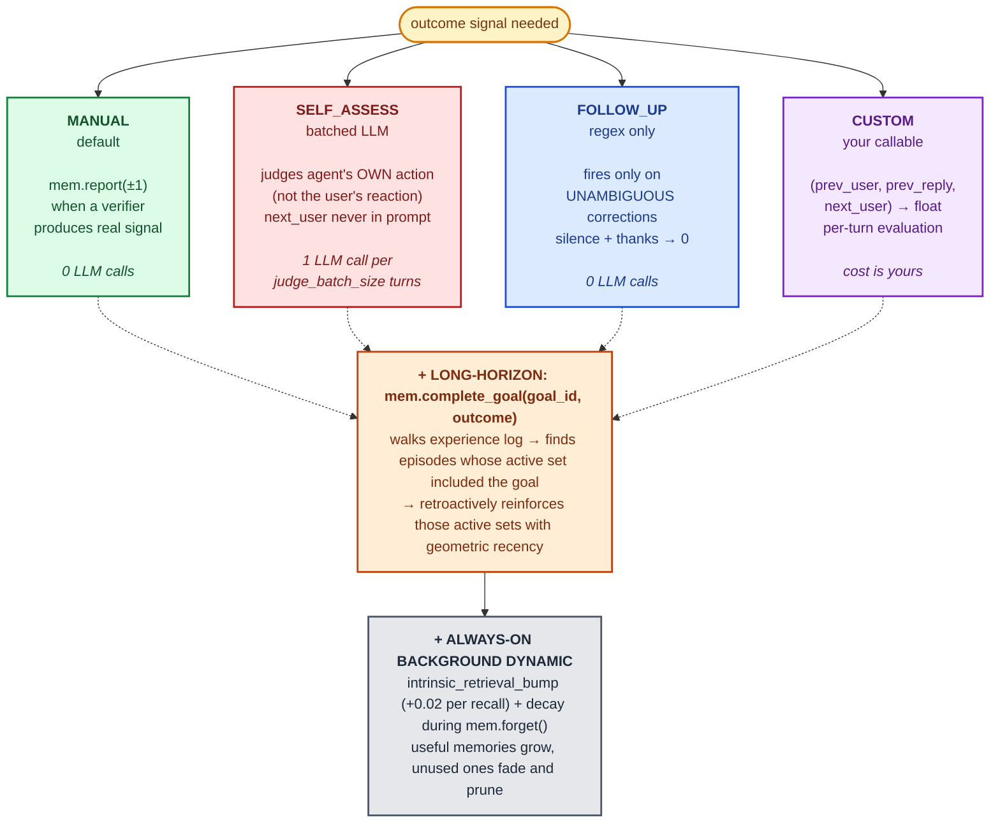
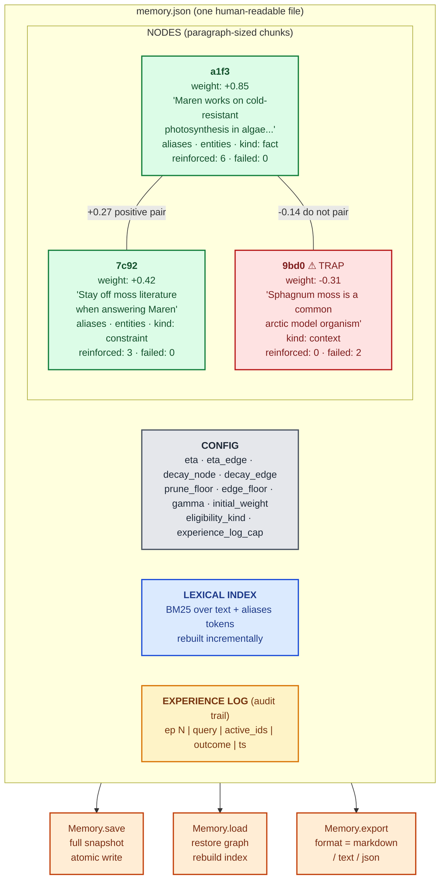

# Architecture

A bird's-eye view of how the pieces fit together and what happens on
each turn.

- [The whole framework at a glance](#the-whole-framework-at-a-glance)
- [Visual tour](#visual-tour) — concrete diagrams of the memory dump
  and every algorithm
- [The three layers](#the-three-layers)
- [Files in `coherence/`](#files-in-coherence)
- [Per-turn flow](#per-turn-flow)
- [Data model](#data-model)
- [LLM call points](#llm-call-points)
- [Persistence](#persistence)
- [Extensibility points](#extensibility-points)
- [What's not in the framework](#whats-not-in-the-framework)

## The whole framework at a glance

Five small color-coded diagrams, one per concept. Read top to bottom.

### 1. Who calls coherence and through what



### 2. The entire algorithmic flow — forward pass, backward pass, updates, in one picture

A layered view of the computation that runs on a single turn. Each layer
is annotated with its operation, its output shape (`|N|` = total nodes,
`k` = retrieved active set size), and a concrete sample so you can
trace one turn end-to-end. State boxes (green) are read by the forward
pass and written by the backward pass.



> **How to read it.** Yellow boxes are inputs to the turn. Green boxes
> are persistent state read by the forward pass and written by the
> backward pass. Blue boxes are the forward-pass layers (one operation
> each, with its output shape). Purple is the layer that selects the
> active set. Pink boxes are the backward-pass layers. Red is the
> resulting weight update. The dashed orange callout next to L4 shows
> the same forward pass run with concrete sample numbers so you can
> trace the math end-to-end. Gray is the periodic maintenance pass
> (decay + prune).

### 3. Recall — `auto` mode picks between LLM and BM25



### 4. Outcome signals — four honest paths, never guess from the user



### 5. The memory dump — what's inside `memory.json`



> **Color key (consistent across all five diagrams):**
> blue = host / I/O · purple = decisions and adapters · orange = orchestrator and persistence · green = data, manual outcome, and intrinsic dynamics · red = LLM cost / trap nodes · gray = config / disk · yellow = audit and start/end markers.

Everything else in this document zooms into the boxes above with
concrete numbers, the exact code paths, and the tunable knobs.

## Visual tour

### What a memory dump looks like

```
+==============================================================================+
|                          memory.json (the entire mind)                       |
+==============================================================================+

  config
  ------
  eta=0.15   eta_edge=0.05   decay_node=0.01   decay_edge=0.02
  prune_floor=0.02   edge_floor=0.01   gamma=0.5   initial_weight=0.10
  eligibility_kind="proportional"   experience_log_cap=5000


  NODES                                                                 EDGES
  -----                                                                 -----

  +----------------------------+   +0.27   +----------------------------+
  | NODE  a1f3                 | <-------> | NODE  7c92                 |
  | -------------------------- | (edge w)  | -------------------------- |
  | text: "Maren works on      |           | text: "Stay off moss       |
  |        cold-resistant      |           |        literature when     |
  |        photosynthesis      |           |        answering Maren's   |
  |        in extremophile     |           |        research."          |
  |        algae."             |           |                            |
  |                            |           |                            |
  | weight:     +0.85          |           | weight:     +0.42          |
  | reinforced: 6              |           | reinforced: 3              |
  | failed:     0              |           | failed:     0              |
  |                            |           |                            |
  | tags:    ["research"]      |           | tags:    ["constraint"]    |
  | aliases:                   |           | aliases:                   |
  |   "my research focus"      |           |   "avoid moss papers"      |
  |   "what I study"           |           |   "stay off moss research" |
  | entities:                  |           | entities:                  |
  |   Chlamydomonas, Maren     |           |   moss, Maren              |
  | kind: "fact"               |           | kind: "constraint"         |
  +----------------------------+           +----------------------------+
              |                                          |
              | -0.14                              +0.05 |
              v                                          v
  +----------------------------+           +----------------------------+
  | NODE  9bd0                 |           | NODE  5d11                 |
  | -------------------------- |           | -------------------------- |
  | text: "Sphagnum moss is    |           | text: "Thylakoid lipid     |
  |        a common arctic     |           |        classes shift at    |
  |        model organism."    |           |        sub-zero temps."    |
  |                            |           |                            |
  | weight:     -0.31  (trap)  |           | weight:     +0.30          |
  | reinforced: 0              |           | reinforced: 2              |
  | failed:     2              |           | failed:     0              |
  | kind: "context"            |           | kind: "fact"               |
  +----------------------------+           +----------------------------+


  EDGES — sparse dict, one entry per unordered pair that has co-fired
  -------------------------------------------------------------------
   (a1f3, 7c92):  +0.27    succeeded together 3 times
   (a1f3, 9bd0):  -0.14    failed together when topic drifted to moss
   (7c92, 9bd0):  +0.18    reinforced together when user re-stated rule
   (a1f3, 5d11):  +0.12    built when discussing algal lipids
   (7c92, 5d11):  +0.05    weak, only co-fired once


  EXPERIENCE LOG — last 5 episodes (audit trail for weight movement)
  ------------------------------------------------------------------
   ep 41 | "lipid remodelling at -5C"    | active=[a1f3, 5d11]      | o=+1.0
   ep 40 | "moss as a model system"      | active=[7c92, 9bd0]      | o=-1.0
   ep 39 | "who works on algae?"         | active=[a1f3]            | o=+1.0
   ep 38 | "pick up where we left off"   | active=[a1f3, 7c92]      | o=+0.8
   ep 37 | "remember my research focus?" | active=[a1f3]            | o=+1.0


  LEXICAL INDEX — inverted-index helper, rebuilt as nodes change
  --------------------------------------------------------------
   token         appears in
   ─────         ───────────────────────────
   "algae"     → a1f3
   "research"  → a1f3, 7c92
   "moss"      → 7c92, 9bd0
   "thylakoid" → 5d11
   "my"        → a1f3, 7c92          (from aliases)
   "study"     → a1f3                (from aliases)
   ...
```

### Forward pass — `recall("tell me about my research")`

```
Step 1: BM25 lexical match (over text + aliases)
------------------------------------------------
  Query tokens (stop-words filtered):  ["tell", "research"]

  Node     Searchable surface (text + aliases)                       Match
  ----     -----------------------------------                       -----
  a1f3     "...algae...my research focus...what I study..."         +0.95  <-- the aliases save it
  7c92     "...moss literature...Maren's research..."               +0.40
  5d11     "...thylakoid lipid classes..."                          +0.00
  9bd0     "...sphagnum moss...arctic model organism..."            +0.00
  (normalize by max so match lives in [0, 1])

                                  |
                                  v

Step 2: base = match + tanh(weight_boost * weight)
--------------------------------------------------
  a1f3:   0.95 + tanh(+0.85) = 0.95 + 0.69 =  +1.64
  7c92:   0.40 + tanh(+0.42) = 0.40 + 0.40 =  +0.80
  5d11:   0.00 + tanh(+0.30) = 0.00 + 0.29 =  +0.29
  9bd0:   0.00 + tanh(-0.31) = 0.00 - 0.30 =  -0.30

                                  |
                                  v

Step 3: spread = sum over neighbors  W_ij * base_j     (gamma = 0.5)
-------------------------------------------------------------------
  a1f3  <-- pulled by 7c92 (+0.27 * 0.80) +0.216
        <-- pulled by 5d11 (+0.12 * 0.29) +0.035
        <-- pulled by 9bd0 (-0.14 * -0.30) +0.042   (negative*negative)
        spread = +0.293

  7c92  <-- pulled by a1f3 (+0.27 * 1.64) +0.443
        <-- pulled by 9bd0 (+0.18 * -0.30) -0.054
        spread = +0.389

  5d11  <-- pulled by a1f3 (+0.12 * 1.64) +0.197
        <-- pulled by 7c92 (+0.05 * 0.80) +0.040
        spread = +0.237

  9bd0  <-- pushed by 7c92 (+0.18 * 0.80) +0.144
        <-- pushed by a1f3 (-0.14 * 1.64) -0.230
        spread = -0.086

                                  |
                                  v

Step 4: activation = tanh(base + gamma * spread)
------------------------------------------------
  a1f3:  tanh(1.64 + 0.5 * 0.293) = tanh(1.79)  =  +0.95   ***
  7c92:  tanh(0.80 + 0.5 * 0.389) = tanh(1.00)  =  +0.76   **
  5d11:  tanh(0.29 + 0.5 * 0.237) = tanh(0.41)  =  +0.39   *
  9bd0:  tanh(-0.30 + 0.5 * -0.086) = tanh(-0.34) = -0.32

                                  |
                                  v

  TOP-3 ACTIVE SET  =   [ a1f3, 7c92, 5d11 ]
```

### Backward pass — `reinforce(active, outcome=+1.0)`

```
(Where did outcome=+1.0 come from? Three honest sources:
  - mem.report(+1.0) called by your host code after a verifier passed,
  - the self_assess judge graded the assistant's own action +1.0, or
  - mem.complete_goal(goal_id, +1.0) attributed credit to this episode.
 The framework does NOT infer outcomes from the user's next message.)

Step 1: eligibility (proportional share of firing)
--------------------------------------------------
  Activations:  a1f3=+0.95  7c92=+0.76  5d11=+0.39
  Sum:          0.95 + 0.76 + 0.39 = 2.10

  elig[a1f3] = 0.95 / 2.10 = 0.452   <-- dominant contributor
  elig[7c92] = 0.76 / 2.10 = 0.362
  elig[5d11] = 0.39 / 2.10 = 0.186

                                  |
                                  v

Step 2: delta-rule node update   dw_i = eta * outcome * elig_i   (eta=0.15)
--------------------------------------------------------------------------
  dw[a1f3] = 0.15 * (+1.0) * 0.452 = +0.0678
  dw[7c92] = 0.15 * (+1.0) * 0.362 = +0.0543
  dw[5d11] = 0.15 * (+1.0) * 0.186 = +0.0279

  Apply:
   a1f3:  +0.85  ->  +0.92     ***  strongest gain
   7c92:  +0.42  ->  +0.47
   5d11:  +0.30  ->  +0.33

                                  |
                                  v

Step 3: Hebbian edge update   dW_ij = eta_edge * outcome * elig_i * elig_j
-------------------------------------------------------------------------
  Pairs in the active set:  (a1f3,7c92), (a1f3,5d11), (7c92,5d11)
  eta_edge = 0.05

  dW[a1f3, 7c92] = 0.05 * (+1) * 0.452 * 0.362 = +0.0082
  dW[a1f3, 5d11] = 0.05 * (+1) * 0.452 * 0.186 = +0.0042
  dW[7c92, 5d11] = 0.05 * (+1) * 0.362 * 0.186 = +0.0034

  Apply:
   (a1f3, 7c92):  +0.27  ->  +0.28
   (a1f3, 5d11):  +0.12  ->  +0.12   (tiny bump)
   (7c92, 5d11):  +0.05  ->  +0.05   (tiny bump)

                                  |
                                  v

Step 4: append episode to experience log
----------------------------------------
   ep 42 | "tell me about my research" | active=[a1f3,7c92,5d11] | o=+1.0
```

### Maintenance pass — `forget()`

```
Decay (every node and every edge, once per call)
------------------------------------------------
  w_i  *= (1 - decay_node)    (decay_node = 0.01 by default)
  W_ij *= (1 - decay_edge)    (decay_edge = 0.02)

   a1f3:  +0.92  ->  +0.911       <-- shrinks slightly
   7c92:  +0.47  ->  +0.465
   5d11:  +0.33  ->  +0.327
   9bd0:  -0.31  ->  -0.307       <-- negative weights also drift to zero
   (a1f3,7c92):  +0.28  ->  +0.274
   (a1f3,9bd0):  -0.14  ->  -0.137

Prune (delete anything that has drifted below |w| floor)
---------------------------------------------------------
  if |w_i|  < prune_floor (=0.02):   delete the node + remove from index
  if |W_ij| < edge_floor  (=0.01):   delete the edge

  After many quiet rounds, nodes that no episode touched drift below
  the floor and disappear from the graph entirely. Strong-negative
  "trap" nodes (e.g. 9bd0 at -0.31) survive as long as |weight| stays
  above the floor, then fade out too.
```

### Ingest enrichment — one LLM call per new memory

```
User says (mid-conversation):
   "I'm working on cold-resistant photosynthesis in extremophile algae,
    focused on Chlamydomonas nivalis and Chloromonas brevispina."

Model emits a tool call:
   memory_ingest({"text": "Maren works on cold-resistant photosynthesis..."})

                                  |
                                  v
        +-----------------------------------------------------+
        |  enrichment.enrich_memory(text, chat_fn)            |
        |  --------------------------------------------------- |
        |  System: "You are a memory analyzer..."              |
        |  User:   "Memory: <the text>"                        |
        +-----------------------------------------------------+
                                  |
                                  v
        +-----------------------------------------------------+
        |  LLM returns JSON:                                  |
        |  {                                                   |
        |    "aliases":  ["my research focus",                |
        |                 "what I study",                     |
        |                 "my work on photosynthesis"],       |
        |    "entities": ["Chlamydomonas nivalis",            |
        |                 "Chloromonas brevispina",           |
        |                 "Maren"],                            |
        |    "kind":     "fact"                                |
        |  }                                                   |
        +-----------------------------------------------------+
                                  |
                                  v

New Node created:
   text     = "Maren works on cold-resistant photosynthesis..."
   weight   = +0.10  (initial)
   metadata = { aliases:[...], entities:[...], kind:"fact" }

Lexical index built from (text + aliases) tokens, so a future query
saying "my work" matches even though "my work" never appears in the
literal text.
```

### Recall — two paths depending on dump size

```
                       recall_mode = "auto"   (default)
                                   |
                                   v
                +----------------------------------+
                |  memory dump (in chars) <        |
                |  recall_threshold_chars ?        |
                +----------------------------------+
                          /                 \
                        yes                  no
                         |                    |
                         v                    v
              +-------------------+   +-------------------+
              | LLM-DRIVEN RECALL |   | BM25 RECALL       |
              | ----------------  |   | ----------------  |
              | Send full dump +  |   | Forward pass over |
              | query to LLM.     |   | inverted index.   |
              | Get top-k IDs as  |   | 0 LLM calls; pure |
              | JSON. 1 LLM call  |   | arithmetic.       |
              | per turn.         |   |                   |
              +-------------------+   +-------------------+

If context_length=200_000:  threshold ~ 80_000 chars  -> LLM until dump is huge.
If context_length=8_000:    threshold ~ 3_200 chars   -> BM25 takes over fast.
```

### Outcome strategies — three honest paths

```
                  Where does the outcome scalar come from?
                  ────────────────────────────────────────

  1)  MANUAL (default)
      ────────────────
      You have a verifier — a test runner, a ground-truth answer, a
      thumbs-up button. You call mem.report(outcome) directly.
      0 LLM calls. Most reliable signal.

  2)  SELF_ASSESS (batched LLM)
      ─────────────────────────
      The LLM grades the assistant's OWN action by looking at:
        - what the user asked,
        - which memories were retrieved,
        - what the assistant replied.
      The next user message is NOT in the prompt. The judge does not
      try to read the user's mood.

      Buffered:
        complete("q1") .. complete("q5")           buffer fills
                              v
                +-------------------------------+
                |  batched_self_assess(buffer)  |   one LLM call
                |  → scores [+1, -1, +1, 0, +0.8]|
                +-------------------------------+
                              v
                  reinforce each turn's active set
                  with its score; clear buffer.

  3)  FOLLOW_UP (opt-in regex)
      ────────────────────────
      Only fires on UNAMBIGUOUS corrections:
        "not what I meant"  →  -1.0
        "that's wrong"      →  -1.0
        "let me clarify"    →  -1.0
        "I told you ..."    →  -1.0
      Anything else, including "thanks", silence, smooth follow-up,
      → 0.0.  Politeness is not evidence; silence is not signal.

  *)  COMPLETE_GOAL (long-horizon)
      ────────────────────────────
      When a goal node is marked achieved/missed:
        mem.complete_goal(goal_id, outcome=+1.0)
      The framework walks the experience log, finds every episode
      whose active set included goal_id, and reinforces those active
      sets with geometric recency weighting. Each supporting memory
      gets credit for its part in the goal.

  Always-on background dynamic:
  ─────────────────────────────
  Every retrieval gives the retrieved nodes a small +intrinsic bump
  (default 0.02). Memories that earn retrieval slowly accumulate
  salience even without explicit outcomes. Combined with decay during
  mem.forget(), this is the safety net that works even in fully
  manual mode.
```

## The three layers

```
        +------------------------------------------+
        |  Your agent loop / harness / Claude Code |
        +------------------------------------------+
                          ▲
                          │
        +------------------------------------------+
        |              AutoMemory                  |   ← recommended entry
        |  recall · ingest · judge · persist       |
        +------------------------------------------+
                          ▲
                          │
        +------------------------------------------+
        |        coherence.integrations            |
        | openai_protocol · anthropic_protocol     |   ← adapters for fixed harnesses
        | mcp · dispatch · MemorySession           |
        +------------------------------------------+
                          ▲
                          │
        +------------------------------------------+
        |                Memory                    |   ← raw memory graph
        |  ingest · recall · reinforce · forget    |
        |  consolidate · save · load · export      |
        +------------------------------------------+
                          ▲
                          │
        +------------------------------------------+
        | matcher · activation · eligibility       |   ← algorithmic primitives
        | reinforce · forget · enrichment · judging|
        | recall_llm                               |
        +------------------------------------------+
```

Most users only ever see `AutoMemory`. Everything below it is exposed
in case you need to skip a layer.

## Files in `coherence/`

| File                       | Responsibility                                                                 |
| -------------------------- | ------------------------------------------------------------------------------ |
| `node.py`                  | The `Node` dataclass: id, text, salience weight, transient activation, tags, metadata, counts. |
| `matcher.py`               | An inverted-index BM25 lexical matcher. Tokenizes text, builds the index, scores a query against every doc. Supports aliases that extend each doc's searchable surface. |
| `activation.py`            | The forward pass for BM25 recall: spreading activation over the graph (`match + tanh(weight) + γ · spread`), bounded by `tanh`. |
| `eligibility.py`           | Credit-assignment shapes: proportional or softmax. Given activations + an active set, returns each node's share of the total firing. |
| `reinforce.py`             | The backward pass: delta-rule update on node weights, Hebbian update on edge weights. |
| `forget.py`                | Weight decay + |w|-floor pruning. The compression half of the implicit objective. |
| `experience.py`            | The `Experience` dataclass: one episode (query, active ids, outcome, timestamp). |
| `graph.py`                 | The `Memory` orchestrator. Owns the node table, edge dict, lexical index, and episode log. Exposes ingest/recall/reinforce/forget/consolidate/save/load/export. |
| `enrichment.py`            | LLM-driven enrichment at ingest: extract aliases, entities, kind tag. One LLM call per new memory. |
| `recall_llm.py`            | LLM-driven recall: send the whole memory dump and the query to the LLM, get back ranked IDs. Returns `[]` if the dump doesn't fit. |
| `judging.py`               | Batched LLM outcome judging: grade N turns in one LLM call, return one score per turn. |
| `autopilot.py`             | The `AutoMemory` wrapper: per-turn orchestration, recall mode selection, judge buffer, history management, persistence. |
| `integrations/tools.py`    | The canonical tool definitions (name, description, parameter schema) — single source of truth for all wire formats. |
| `integrations/openai_protocol.py` | Reshapes the tools for the OpenAI `/chat/completions` wire format and executes tool calls. |
| `integrations/anthropic_protocol.py` | Same, for the Anthropic Messages API. |
| `integrations/mcp.py`      | Same, as MCP server tool descriptors (Claude Code, Cursor, etc.). |
| `integrations/session.py`  | A small context manager: `with session.episode(...) as ep: ... ep.success()`. |

## Per-turn flow

When you call `mem.complete(user_message)` on `AutoMemory`, this is
what happens, in order:

```
   user_message
        │
        ▼
┌─────────────────────────────────────────────────────────────────┐
│ 1. Close out the previous turn                                  │
│    Move the staged previous turn into the judge buffer with     │
│    next_user = this user_message.                               │
│    If buffer ≥ judge_batch_size and strategy == "llm":          │
│       → ONE LLM call grades the whole buffer (judging.py)       │
│       → Apply reinforcement (reinforce.py) for each turn        │
└─────────────────────────────────────────────────────────────────┘
        │
        ▼
┌─────────────────────────────────────────────────────────────────┐
│ 2. Recall                                                       │
│    recall_mode == "auto":                                       │
│      if memory_dump_chars < recall_threshold_chars:             │
│         → LLM recall (recall_llm.py)                            │
│         → ONE LLM call, returns ranked IDs                      │
│      else:                                                      │
│         → BM25 recall (matcher.py + activation.py)              │
│         → 0 LLM calls; pure arithmetic over inverted index      │
│    recall_mode == "llm":  always try LLM, fall back to BM25     │
│    recall_mode == "bm25": always use BM25                       │
│                                                                 │
│    Pack the recalled nodes into context_budget_tokens.          │
└─────────────────────────────────────────────────────────────────┘
        │
        ▼
┌─────────────────────────────────────────────────────────────────┐
│ 3. Build the per-turn prompt                                    │
│    [system prompt] + [chat history] +                           │
│      [system note: recalled memories + active goals] +          │
│      [user message]                                             │
└─────────────────────────────────────────────────────────────────┘
        │
        ▼
┌─────────────────────────────────────────────────────────────────┐
│ 4. Generate (the agent's own LLM call)                          │
│    chat_fn(messages, tools=[memory_recall, memory_ingest,       │
│                              memory_reinforce,                  │
│                              memory_maintenance])               │
│                                                                 │
│    If the model emits tool_calls, dispatch them through         │
│    integrations.openai_protocol.run_openai_tool_calls():        │
│      - memory_recall    → forward pass, return memories         │
│      - memory_ingest    → Memory.ingest(...)                    │
│                            → triggers enrichment.enrich_memory  │
│                            → ONE LLM call per ingest            │
│      - memory_reinforce → Memory.reinforce(...)                 │
│      - memory_maintenance → Memory.forget() + consolidate       │
│                                                                 │
│    Loop until the model produces a non-tool reply.              │
└─────────────────────────────────────────────────────────────────┘
        │
        ▼
┌─────────────────────────────────────────────────────────────────┐
│ 5. Stage this turn                                              │
│    pending = {user, reply, active_ids, next_user=None}          │
│    Append (user_message, reply) to canonical history.           │
└─────────────────────────────────────────────────────────────────┘
        │
        ▼
┌─────────────────────────────────────────────────────────────────┐
│ 6. Persist                                                      │
│    If save_every_turn=True and path is set:                     │
│       → Memory.save(path) writes the whole graph to JSON        │
└─────────────────────────────────────────────────────────────────┘
        │
        ▼
   final_text
```

## Data model

The memory graph has three tables and one log:

```
nodes : id → Node
─────────────────────────────────────
{
  id, text, weight, activation,
  tags, metadata = {
    aliases:  [...],   ← from enrichment
    entities: [...],   ← from enrichment
    kind:     "...",   ← from enrichment
  },
  reinforcement_count, failure_count,
  created_at, last_reinforced_at
}

edges : (id_low, id_high) → float
─────────────────────────────────────
A single signed scalar per unordered pair of nodes.
Positive → "these go together"; negative → "do not pair";
near zero → no opinion; missing → never co-active yet.

index : LexicalIndex
─────────────────────────────────────
An inverted index over the union of (node.text + aliases) tokens.
Maintained incrementally as nodes are added/edited/removed.
Used only on the BM25 recall path.

experiences : list[Experience]
─────────────────────────────────────
The most recent N episodes: (query, active_ids, outcome, timestamp).
Bounded by experience_log_cap. Audit trail for why a weight moved.
```

The data lives entirely in plain Python objects in memory; `save` and
`load` round-trip everything to a single JSON file.

## LLM call points

A 10-turn session, all defaults (`outcome_strategy="manual"`,
`recall_mode="auto"`, dump fits the threshold, agent ingests 2 new
facts):

| Operation        | When                               | Count |
| ---------------- | ---------------------------------- | ----- |
| Agent generation | Per turn                           | 10    |
| LLM recall       | Per turn while dump fits threshold | 10    |
| Ingest enrichment| Per ingest                         | 2     |
| Outcome judging  | Only when `mem.report()` fires     | 0     |

Switch to `outcome_strategy="self_assess"` and `judge_batch_size=5`
and you add ~2 batched judging calls per 10 turns.
`outcome_strategy="follow_up"` adds 0 (it's a regex check).
`recall_mode="bm25"` drops the per-turn recall column to 0.

If the memory dump outgrows `recall_threshold_chars`, the LLM-recall
column drops to 0 — BM25 takes over silently.

Every LLM call is routed through a single `chat_fn` callable you
supply when constructing `AutoMemory`. You can split that into four
separate endpoints (`chat_fn`, `judge_chat_fn`, `recall_chat_fn`,
`enrich_chat_fn`) so e.g. the agent runs on a frontier model while
judging, recall, and enrichment hit a cheaper one.

## Persistence

`memory.json` is the single source of truth. It contains:

- `config`: the learning-rule knobs (eta, decay, floors, …) so a
  reloaded memory continues with the same dynamics.
- `nodes`: every node with its full metadata.
- `edges`: every pair's weight.
- `experiences`: the recent episode log.
- `episode_counter`, `saved_at`.

Save is atomic from the user's perspective — `Memory.save` writes the
whole file in one `Path.write_text`. There is no append log; every save
is a fresh full snapshot. The file is human-readable and editable: open
it in any editor and the next `Memory.load(path)` picks up changes.

`Memory.export(path, format)` emits a different shape for human review:

- `"markdown"` (default): grouped by tag and `kind`, sorted by salience,
  with strongest associations and recent episodes.
- `"text"`: flat `[weight] text` list.
- `"json"`: equivalent to `save`.

## Extensibility points

The framework is designed so each LLM-touching component can be swapped
or extended without touching the core algorithm:

| Want to…                                         | Override                                                |
| ------------------------------------------------ | ------------------------------------------------------- |
| Use a different chat backend                     | Pass your own `chat_fn`                                 |
| Grade outcomes with a cheaper model              | Pass `judge_chat_fn` / `judge_model`                    |
| Enrich with a cheaper model                      | Pass `enrich_chat_fn` / `enrich_model`                  |
| Run recall against a different model             | Pass `recall_chat_fn` / `recall_model`                  |
| Plug in a non-LLM verifier                       | `outcome_strategy=callable` or `"manual"` + `mem.report` |
| Add a domain-specific enricher                   | Set `mem.memory.ingest_enricher = my_callable`          |
| Disable enrichment                               | `enrich_on_ingest=False`                                |
| Skip the per-turn recall LLM call                | `recall_mode="bm25"`                                    |
| Run on an MCP server                             | `coherence.integrations.mcp_tool_descriptors`           |
| Drive every step by hand                         | Use `Memory` directly                                   |

The orchestrator (`AutoMemory`) is intentionally light — it composes
the small algorithmic modules (`matcher`, `activation`, `reinforce`,
`forget`) and the LLM helpers (`enrichment`, `judging`, `recall_llm`)
into a single per-turn flow. Each module is independently testable and
independently swappable.

## What's not in the framework

- **No model is bundled.** You supply `chat_fn`.
- **No HTTP client is bundled.** `examples/_azure_client.py` is a
  100-line stdlib reference; pick any client you like.
- **No vector store.** Recall is either an LLM call over the in-memory
  dump or a BM25 pass over an inverted index — both live in the same
  Python process, both serialize into the same JSON file.
- **No background processes.** The framework only runs when you call
  it. Maintenance (`mem.forget`, `mem.consolidate`) is explicit, either
  from your code or via the `memory_maintenance` tool the LLM may
  decide to call.
